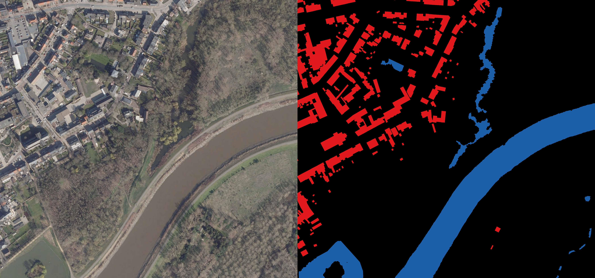
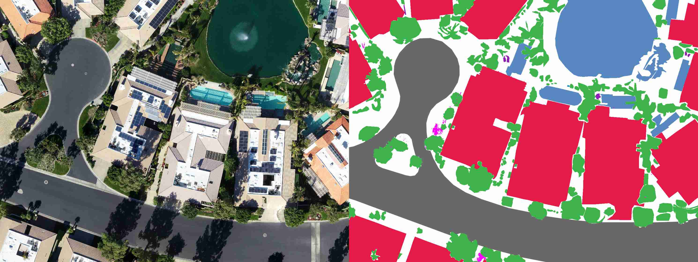
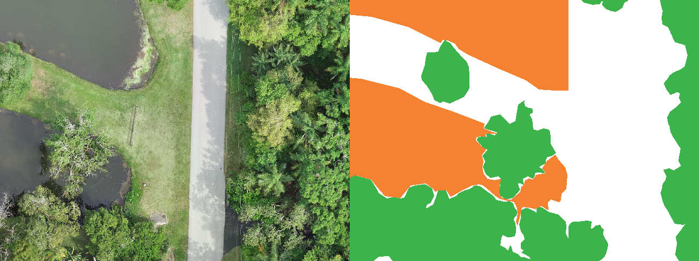

# Datasets

**High-Level Planning Vision Component Datasets**

The dataset used for training is too large for GitHub, please contact me at
[pieter@pfiers.net](mailto:pieter@pfiers.net).

## IV Ortho Mid

Arbitrary selection from Informatie Vlaanderen's
'Orthofotomozaiek_middenschalig_winteropnamen_kleur_meest_recent'.

https://download.vlaanderen.be/Producten/Detail?id=1545&title=Orthofotomozaiek_middenschalig_winteropnamen_kleur_meest_recent_Vlaanderen_2021_04

## Dronedeploy Dataset

DroneDeploy Segmentation Dataset with manual corrections for bad data
(transparent, no label, etc.).

https://github.com/dronedeploy/dd-ml-segmentation-benchmark

